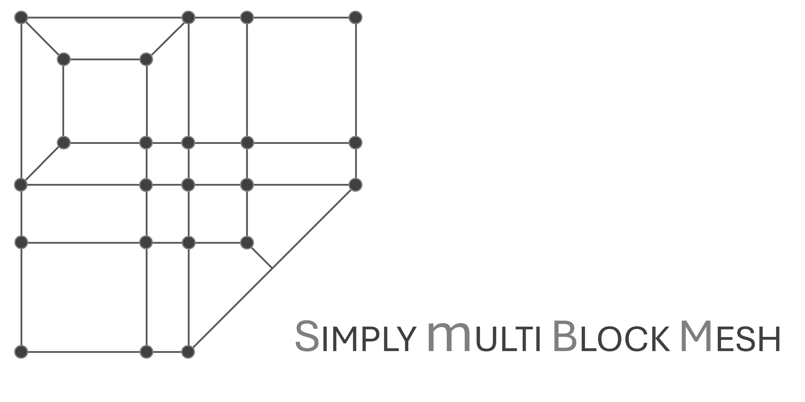
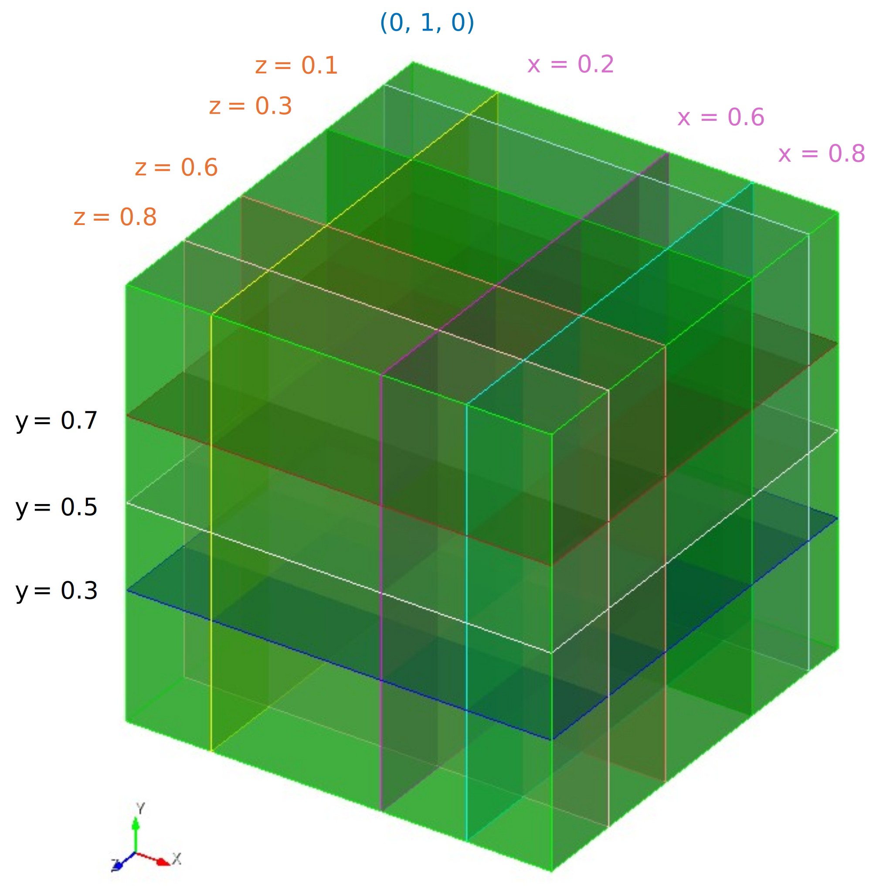
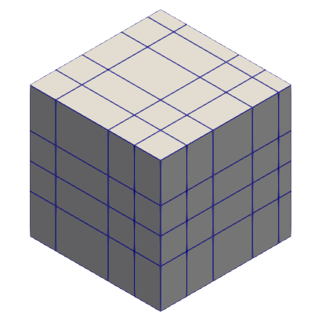
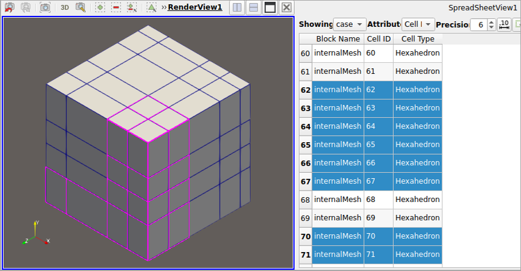
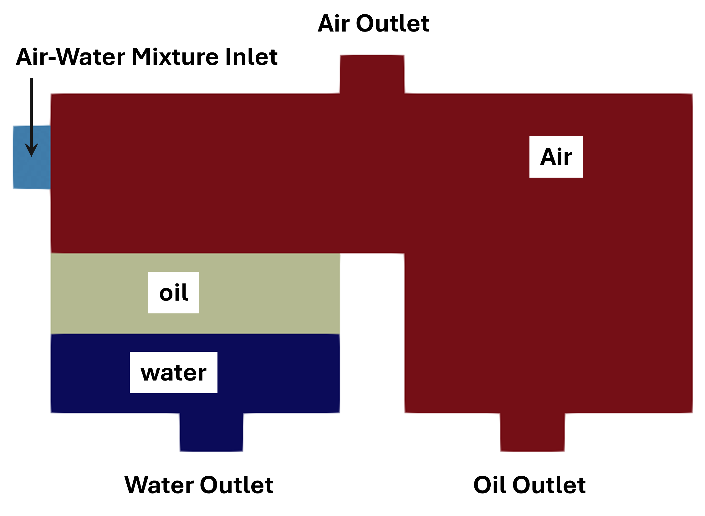
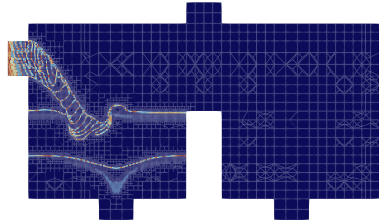

[](https://doi.org/10.5281/zenodo.18209668)

# Simply multiBlockMesh

**Simply multiBlockMesh** (SimBloM) - Python tool for multi-block **blockMeshDict** (OpenFOAM) generator to create block structured mesh.




<br>

### Table of Contents

1. [About](#about)
2. [Why "Simply MultiBlockMesh"](#why-simply-multiblockmesh)
3. [User Manual](#user-manual)
4. [How To Use](#how-to-use)
5. [Example Workflow](#example-workflow)

    1. [Input Setup](#input-setup)
    2. [First Run](#first-run)
    3. [Subsequent Runs to Create Target Mesh](#subsequence-runs-to-create-target-mesh)

        1. [Removing Blocks](#removing-blocks)
        2. [Modifying Blocks](#modifying-blocks)
        3. [Defining Boundary Conditions](#defining-boundary-conditions)

6. [Test Case](#test-case)


<br>

### About

**Simply MultiBlockMesh** is a python tool for easy, fast, and robust way of generating multi-block **blockMeshDict** for OpenFOAM. The purpose of this script is to create complex `multi-block` **blockMeshDict**, based on the user input.

**Simply MultiBlockMesh** works in an iterative way. First, it creates a simple `brick-like` mesh/domain from the user's input. Then by defining  more specific "edit entries" as user input, **Simply MultiBlockMesh** generates fine structured mesh representing complex geometries (or, domains).

There are other sophisticated tools/libraries available for making beautiful, yet complex structured mesh, for example - [Classy Blocks](https://github.com/damogranlabs/classy_blocks). [^1]


<br>

### Why "Simply MultiBlockMesh"

**Simply MultiBlockMesh** (SimBloM) aims to make the multi-block mesh with **blockMesh** faster, and more intuitive. Think of it this way, **blockMesh works in a bottom up approach** and the process begins with - 

- Defining **vertices**
- Defining **edges** - all straight line, implicitly defined when defining block
- Defining **faces** - again, implicitly defined when defining block
- Defining **block**/**hex**

<br>

> **Simply MultiBlockMesh** (SimBloM) provides a top down intuition to its user to think about the mesh from a high level (a birds eye view) and **Simply multiBlockMesh** will handle the low level implementation.

<br>

With **Simply multiBlockMesh**, the user needs to think about the mesh from a "block" point of view.

- It makes easier to remove/edit blocks
- It provides fast and easy to collapse faces/edges

    - Identify the block id
    - Provide the location/position of the  edge(s) and vertices(s)
    - Simply blockMesh will do it without the user having to manually make multiple changes in the **blockMeshDict** file.

- it's asy to implement edge features (arc, spline, polyline)
- Defining boundary/patch is intuitive

    - Identify exterior block(s) to implement a patch
    - Tell **Simply multiBlockMesh** the block id(s) and the face(s) (front/back/left/right/top/down)
    - Provide the patch name(s) and type(s)
    - **Simply multiBLockMesh** will handle the low level implementation of converting block/face information into blockMesh path entry.

<br>

**Simply MultiBlockMesh** does not create predefined shapes, directly. It's still the user who makes the mesh, **Simply MultiBlockMesh** helps the user to do is - **faster, more reliably and with more ease**.

<br>

**To summarize** - While **blockMesh** workflow is a `bottom up way`, **Simply multiBlockMesh** is a `top down way` and more intuitive way of working with blockMesh.

<br>

### User Manual

Detailed explanation with examples on how to use the **Simply multiBlockMesh** can be found in the [user manual](./manual/README.md) sectio.

<br>

### How To Use

1. Download the **code** directory.
2. Download/copy the **user input** (shell script) template (in your `working directory` or anywhere in your local disk).
3. Fill out the user input file.
4. Run the shell scripts (user input) to get a `blockMeshDict`.
5. Run `blockMesh` using the created `blockMeshDict`
    1. Get the initial brick-like domain.
    2. Add blocks/hexes as needed in the "exclusion list" in the user input (after initial run).
    3. Add edge definition if curved topology is needed (using the `block_edit_*py` file).
5. Rerun the script with updated user input to get an `updated blockMeshDict`.
    1. Run `blockMesh` again to get updated mesh
7. Add boundaries/patch using the `block_edit_*py` file.


<br>

### Example Workflow

#### Input Setup

To create a multi-block blockMeshDict using this script the user need to provide the required information. Below as a sample user input file which can be found in the `input_template` directory.

```sh


#---------------------------------------
### This is the working directory
### This shell doesn't need to be in the working directory.
export_directory="/path/to/the/export/directory"

#---------------------------------------
### Read multi-block edit file? "yes" or "no"
read_edit_file="yes"

#---------------------------------------
### For scaling the mesh
### All dimensions gets multiplied by
### the value of "convert_to_meters" globally

convert_to_meters=1

#---------------------------------------

bounding_box='{
    "x-min" : 0.0,
    "x-max" : 1.0,
    "y-min" : 0.0,
    "y-max" : 1.0,
    "z-min" : 0.0,
    "z-max" : 1.0
}'

#---------------------------------------
### CUT PLANE LIST
###
### x --> x-coordinate for YZ plane
### y --> x-coordinate for ZX plane
### z --> x-coordinate for XY plane

split_plane_list='{
    "x" : [0.2, 0.6, 0.8],
    "y" : [0.3, 0.5, 0.7],
    "z" : [0.1, 0.3, 0.6, 0.8]
}'

#---------------------------------------

gid_spacing='{
    "x" : 0.01,
    "y" : 0.005,
    "z" : 0.01
}'

#---------------------------------------

hex2exclude='{
    "exclude-list" : []
}'

#---------------------------------------

export export_directory
export read_edit_file
export bounding_box
export convert_to_meters
export split_plane_list
export gid_spacing
export hex2exclude

#---------------------------------------
### Provide the path of the python interpreter
python="path/to/the/python/interpreter"

#---------------------------------------
### Provide the path where the "simply_multiblockmesh.py" file is located
### Make sure the "classes" file and the "case_system_template" directory (with its contents) are also in the same directory.
simply_multiblockmesh="path/to/the/'simply_multiblockmesh.py'/script/in/local/disk"

#---------------------------------------

VSEP="----------------------------------------"

$python $simply_multiblockmesh

... ... ...
... ... ..

```

The `read_edit_file="yes"` tells the SimBloM script to read the `block_edit_*.py` file and implement the edits defined.

For the first run, there will not be a `block_edit_*.py` file. But the SimBloM will create a template file in the working directory during the first run of the tool.

The `convert_to_meters=1` is the blockMesh way of applying a global scaling of the dimension. Choose a value according to the need.

The `bounding_box` contains the min/max of teh overall mesh/domain. This is the overall dimension of the mesh/domain.

The `split_plane_list` is the x, y, z locations where the `bounding box` will be split to create the individual blocks. If there is no split needed along any of the directions, leave the list empty.



The `grid_spacing` parameter contains the distance of the grid lines along x, y, z directions.

The `hex2exclude` parameter contains the exclude the individual blocks from the multi-block brick-like mesh.

The `user input` also asks the user to provide the path of the python interpreter intended to use to run the python script, as well as, the location of the `simply_multiblockmesh.py` script in the local disk (after downloading).


<br>

#### First Run

Once the user input is provided and the script is executed, it creates the following items - 

```
working directory
  |---- case
  |       |---- system
  |               |---- blockMeshDict
  |               |---- controlDict
  |               |---- fvSchemes
  |               |---- fvSolution
  |
  |---- block_edit_[time-stamp].py
  |---- edge_information.txt
  |---- face_information.txt
  |---- slice_information.txt
  |---- xyz_locations.txt

````

After the first run, the created blockMeshDict will look like the image beklow, if a large value is given for the grid spacing. For example - 

```sh
gid_spacing='{
    "x" : 10000,
    "y" : 10000,
    "z" : 10000
}'
```



If the grid spacing is larger than the block dimension, all the generated blocks will be `a single large cell`. This `single cell block representation` helps identifying the individual blocks to be removed and/or modified.

Here is a snippet of a generated blockMeshDict, after the initial run - 

```C

... ... ...
... ... ...


vertices
(
    // ==== y-0, z-0 ==== //

    (-0.012 -0.012 -0.1)    // vertex-0
    (0.0 -0.012 -0.1)    // vertex-1
    (0.04 -0.012 -0.1)    // vertex-2
    (0.06 -0.012 -0.1)    // vertex-3
    (0.09 -0.012 -0.1)    // vertex-4
    (0.11 -0.012 -0.1)    // vertex-5
    (0.14 -0.012 -0.1)    // vertex-6
    (0.16 -0.012 -0.1)    // vertex-7
    (0.2 -0.012 -0.1)    // vertex-8

    // ==== y-1, z-0 ==== //

    (-0.012 0.0 -0.1)    // vertex-9
    (0.0 0.0 -0.1)    // vertex-10
    (0.04 0.0 -0.1)    // vertex-11
    (0.06 0.0 -0.1)    // vertex-12
    (0.09 0.0 -0.1)    // vertex-13
    (0.11 0.0 -0.1)    // vertex-14
    (0.14 0.0 -0.1)    // vertex-15
    (0.16 0.0 -0.1)    // vertex-16
    (0.2 0.0 -0.1)    // vertex-17

    ... ... ...
    ... ... ...

);

blocks
(
    // ==== block-0__x-0_y-0_z-0 ==== //
    hex (  0   1  10   9  63  64  73  72) (2 2 18) simpleGrading (1 1 1)

    // ==== block-1__x-1_y-0_z-0 ==== //
    hex (  1   2  11  10  64  65  74  73) (8 2 18) simpleGrading (1 1 1)

    // ==== block-2__x-2_y-0_z-0 ==== //
    hex (  2   3  12  11  65  66  75  74) (3 2 18) simpleGrading (1 1 1)

    // ==== block-3__x-3_y-0_z-0 ==== //
    hex (  3   4  13  12  66  67  76  75) (6 2 18) simpleGrading (1 1 1)

    // ==== block-4__x-4_y-0_z-0 ==== //
    hex (  4   5  14  13  67  68  77  76) (4 2 18) simpleGrading (1 1 1)

    ... ... ...
    ... ... ...

);

edges
(
);

boundary
(
);

mergePatchPair
(
);

```

<br>

#### Subsequent Runs to Create Target Mesh

##### Removing Blocks

If any blocks needs to be removed from the `brick-like` multi-block, identify the id of the target blocks. This can be done in post-processor like ParaView (spreadsheet view). 



Once, all the ids of the target block are identified, these ids can be added in the "hex2exclude" parameter in the user input. The blockMeshDict then needs to be recreated by running the script with the updated user input.


<br>

##### Modifying Blocks
if any of the block edges needs to be modified to achieve curved topology. Arc, splice, and polyline can be added, using the `block_edit_*.py` file.


Sample arc definition in the `block_edit_*.py` file - 

```python

edgeEdit[1] = {
    ### Type of edge edit
    "edit-type" : "make-arc",

    ### Method for defining the arc-point
    "method" : "arc-point",
    
    ### Edge detail
    "edge":{
        "block-id" : 2,
        "position" : ["back", "top"],
        },
    
    ### Defining point
    "arc-point" : [1.25, 0.25, 0.0],
}

edgeEdit[2] = {
    ### Type of edge edit
    "edit-type" : "make-spline",

    ### Method for defining the arc-point
    "method" : "spline-point",
    
    ### Edge detail
    "edge":{
        "block-id" : 3,
        "position" : ["back", "top"],
        },
    
    ### Defining points
    "spline-point" : [
            [0.6, 1.2, 0.0],
            [0.7, 1.5, 0.0],
            [0.8, 1.2, 0.0],
        ],
}

```

```C
edges
(
    arc 6 7 (1.25, 0.25, 0.0)

    spline 7 8
    (
        (0.6, 1.2, 0.0)
        (0.7, 1.5, 0.0)
        (0.8, 1.2, 0.0)
    )


);

```


<br>

##### Defining Boundary Conditions

When the `simply_multiblockmesh.py` script is executed, ie creates files to write edge, face, and slice information, in a well organized manner. Here is a snippet of the `face_information.txt` file content - 

```
----------------------------------------
FACE INFO
----------------------------------------

Block-0 : x-0_y-0_z-0

    front  : (v12 (0.0 0.0 0.1) v16 (0.0 0.5 0.1) v17 (0.4 0.5 0.1) v13 (0.4 0.0 0.1))
    back   : (v0 (0.0 0.0 0.0) v1 (0.4 0.0 0.0) v5 (0.4 0.5 0.0) v4 (0.0 0.5 0.0))
    left   : (v0 (0.0 0.0 0.0) v4 (0.0 0.5 0.0) v16 (0.0 0.5 0.1) v12 (0.0 0.0 0.1))
    right  : (v13 (0.4 0.0 0.1) v17 (0.4 0.5 0.1) v5 (0.4 0.5 0.0) v1 (0.4 0.0 0.0))
    bottom : (v0 (0.0 0.0 0.0) v12 (0.0 0.0 0.1) v13 (0.4 0.0 0.1) v1 (0.4 0.0 0.0))
    top    : (v4 (0.0 0.5 0.0) v5 (0.4 0.5 0.0) v17 (0.4 0.5 0.1) v16 (0.0 0.5 0.1))


Block-1 : x-1_y-0_z-0

    front  : (v13 (0.4 0.0 0.1) v17 (0.4 0.5 0.1) v18 (0.6 0.5 0.1) v14 (0.6 0.0 0.1))
    back   : (v1 (0.4 0.0 0.0) v2 (0.6 0.0 0.0) v6 (0.6 0.5 0.0) v5 (0.4 0.5 0.0))
    left   : (v1 (0.4 0.0 0.0) v5 (0.4 0.5 0.0) v17 (0.4 0.5 0.1) v13 (0.4 0.0 0.1))
    right  : (v14 (0.6 0.0 0.1) v18 (0.6 0.5 0.1) v6 (0.6 0.5 0.0) v2 (0.6 0.0 0.0))
    bottom : (v1 (0.4 0.0 0.0) v13 (0.4 0.0 0.1) v14 (0.6 0.0 0.1) v2 (0.6 0.0 0.0))
    top    : (v5 (0.4 0.5 0.0) v6 (0.6 0.5 0.0) v18 (0.6 0.5 0.1) v17 (0.4 0.5 0.1))


... ... ...
... ... ...

```

<br>

These files, along with visually identifying blocks (using ParaView), users can easily define `boundary definition` in the `block_edit_*.py` file.


Using the information saved in the `face_information.txt` file, boundary conditions (patches) can be defined (manually). Re-run`blockMesh`after defining the boundaries.

Example of a boundary/patch input from user

```python
boundary[1] = {
    "name" : "dummy_inlet",
    "type" : "inlet",
    "faces" : [
            [0, "left"],    ### [block-id, face-name]
            ### Add more faces as [block-id, face-name] list entry (if application) 
        ]

boundary[2] = {
    "name" : "dummy_outlet",
    "type" : "outlet",
    "faces" : [
            [11, "right"],    ### [block-id, face-name]
        ]
}
    
}
```

The corresponding entry in the generated ***blockMeshDict**

```C++

boundary
(
    dummy_inlet
    {
        type    inlet;
        faces
        (
            /*
            Face definition autogenerated from this entry
            --> "faces" : [[11, "right"],
            */
            (0 4 16 12)
        );
    }


    dummy_outlet
    {
        type    outlet;
        faces
        (
            /*
            Face definition autogenerated from this entry
            --> "faces" : [[0, "left"],
            */
            (31 35 23 19)
        );
    }


);
```

<br>

### Test Case
#### Oil-Water Separator


A use case of this tool is a simplified case setup for `oil water separator` which can be found [here](./test_case/oil_water_seperator/). This test case is inspired by this [Youtube video](https://www.youtube.com/watch?v=a4UAMpPdGV0), but the domain is significantly reduced for faster simulation. 

The mesh created for this `oil-water separator` is overly simplified and **blocky** (no pun intended). The case setup was fast, and aimed for a proof-of-concept demonstration.

<br>

> Oil-Water Separator Simulation Using Dynamic Mesh Refinement (all phases)
>
> Time : 0.0



<br>

> Oil-Water Separator Simulation Using Dynamic Mesh Refinement (all phases)
>
> Time : 0.1


<br>

**NOTE:** The test case is run using a custom OpenFOAM solver [multiInterfaceDyMFoam](https://github.com/noman-mnhasan/OpenFOAM_multiInterfaceDyMFoam) which allows the Dynamic Mesh refinement to be implemented at multiple interfaces, without having the refine the cells containing a single phase. **This feature is not available in the standard `multiphaseInterFoam` solver**. 

<br>

> Oil-Water Separator Simulation Using Dynamic Mesh Refinement (Interface only)
>
> Time : 0.1



<br>

The dynamic mesh refinement is achieved by the `dynamicRefineFvMesh` option in the `constant/dynamicMeshDict`. The simulation can easily be run using the `multiphaseInterFoam` solver without the high resolution interface tracking.


<br>

#### Reference

[^1]: Jurkovič, N. classy_blocks [Computer software]. https://doi.org/10.5281/zenodo.16785017


