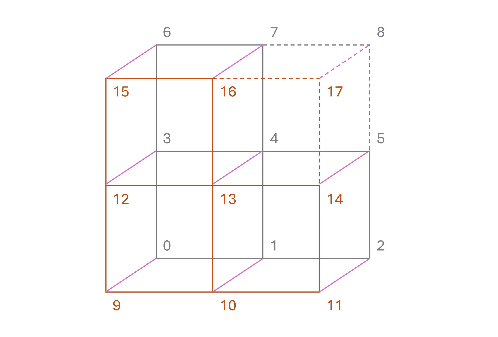
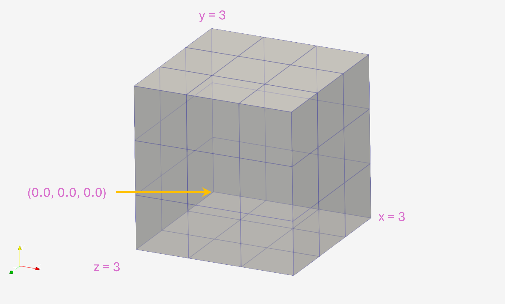

# Simply multiBlockMesh Manual

User manual for **Simply multiBLockMesh** (SimBloM)


## Table of Contents

- [Vertex Sequence and Numbering](#vertex-sequence-and-numbering)
- [Block Sequence and Numbering](#block-sequence-and-numbering)
- [Feature Manual](./feature/README.md)
    - [Vertex Features](./feature/README.md#vertex-feature)
    - [Edge Feature](./feature/README.md#edge-feature)
    - [Block Feature](./feature/README.md#block-feature)


<br>

#### Vertex Sequence and Numbering

Let's have a look on the sequence of vertex creation and numbering used in **Simply multiBlockMesh**. This will help us to have a clearer understanding of the illustrated examples in the manual.




**Figure**: Vertex creation sequence in **Simply multiBlockMesh** (SimBloM)

<br>

The illustrated `multi-block` has a `bounding box` of `x : 0 --> 1`, `y : 0 --> 1` and `z : 0 --> 0.2`, The bounding box is then split at `x = 0.5` and `y = 0.5`. Finally, the `top-right` block (block 3) has been removed (excluded). This is why, that block is outlined by dashed lines. The setup code is - 

```bash

bounding_box='{
    "x-min" : 0.0,
    "x-max" : 1.0,
    "y-min" : 0.0,
    "y-max" : 1.0,
    "z-min" : 0.0,
    "z-max" : 0.2
}'

... ... ...
... ... ...

split_plane_list='{
    "x" : [0.5],
    "y" : [0.5],
    "z" : []
}'

... ... ...
... ... ...


hex2exclude='{
    "exclude-list" : [3]
}'

```
<br>

#### Block Sequence and Numbering

The block numbering starts from 0, and the starting position for the are from `x = x-min, y = y-min, z = z-min` location. That means -

```C++
    /*
        Following the blockMesh Convention back-to-front and counter clock-wise
        Back face  : 0  1  2  3
        Front face : 9 10 13 12
    */

    // Block 0
    hex(0 1 2 3 9 10 11 13 12) ... ... ...
```

The block number sequence for **Simply multiBlockMesh** is as explained in the following section. A 3 x 3 x 3 multi-block would look like this - 




<br>

**Simply multiBlockMesh** numbers these blocks as shown below - 

<br>


```
    ### For a 3 x 3 x 3 multi-block
    ### Let, x : 0 -> 3
             y : 0 -> 3
             z : 0 -> 3


    z = 0 (back face) - 1 (front face)
    **********************************

    ----------------    y = 3
    |  6 |  7 |  8 |
    ----------------
    |  3 |  4 |  5 |
    ----------------
    |  0 |  1 |  2 |
    ----------------    y = 0
  x = 0          x = 3


    z = 1 (back face) - 2 (front face)
    **********************************

    ----------------    y = 2
    | 15 | 16 | 17 |
    ----------------
    | 12 | 13 | 14 |
    ----------------
    |  9 | 10 | 11 |
    ----------------    y = 0
  x = 0          x = 3


    z = 2 (back face) - 3 (front face)
    **********************************

    ----------------    y = 2
    | 24 | 25 | 26 |
    ----------------
    | 21 | 22 | 23 |
    ----------------
    | 18 | 19 | 20 |
    ----------------    y = 0
  x = 0          x = 2

```

The **Simply multiBlockMesh** (SimBloM) tool writes a text file containing the slice slice information. The slice info for the setup shown above, would look like this - 

```
### SLICE INFO ###
----------------------------------------
SLICE PLANE - XY
----------------------------------------
Slice Index -    0 | Blocks :  0,  1,  2,  3,  4,  5,  6,  7,  8
Slice Index -    1 | Blocks :  9, 10, 11, 12, 13, 14, 15, 16, 17
Slice Index -    2 | Blocks : 18, 19, 20, 21, 22, 23, 24, 25, 26
----------------------------------------
SLICE PLANE - YZ
----------------------------------------
Slice Index -    0 | Blocks :  0,  3,  6,  9, 12, 15, 18, 21, 24
Slice Index -    1 | Blocks :  1,  4,  7, 10, 13, 16, 19, 22, 25
Slice Index -    2 | Blocks :  2,  5,  8, 11, 14, 17, 20, 23, 26
----------------------------------------
SLICE PLANE - ZX
----------------------------------------
Slice Index -    0 | Blocks :  0,  9, 18,  1, 10, 19,  2, 11, 20
Slice Index -    1 | Blocks :  3, 12, 21,  4, 13, 22,  5, 14, 23
Slice Index -    2 | Blocks :  6, 15, 24,  7, 16, 25,  8, 17, 26

```

Here the user can see the slices along all three planes (xy, yz, and zx).


