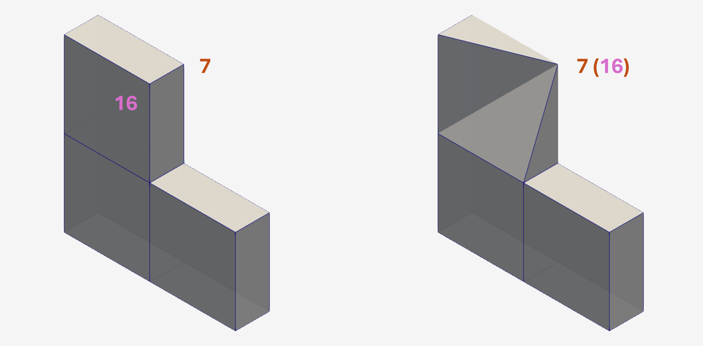
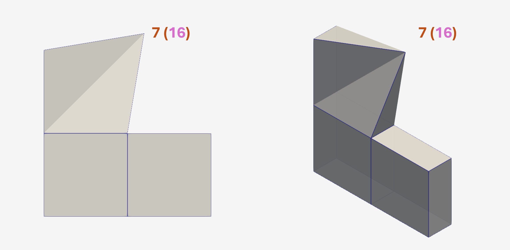
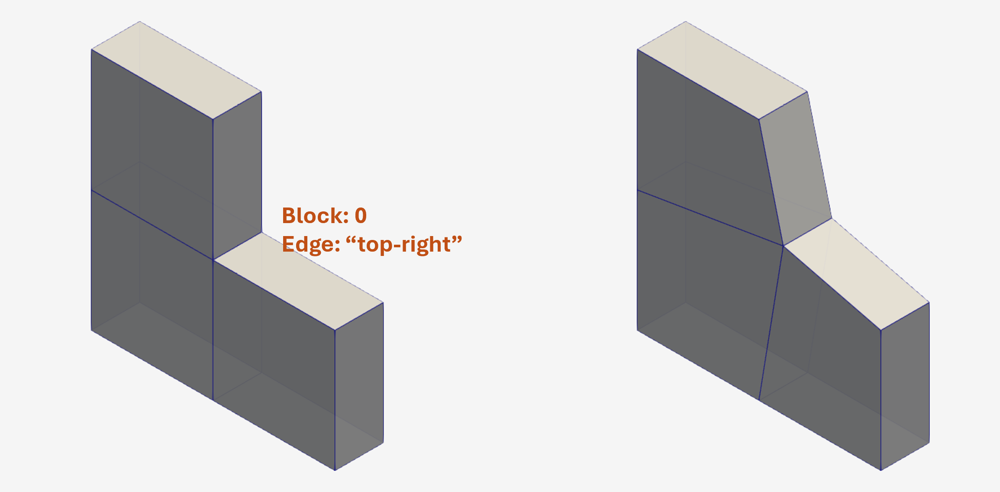
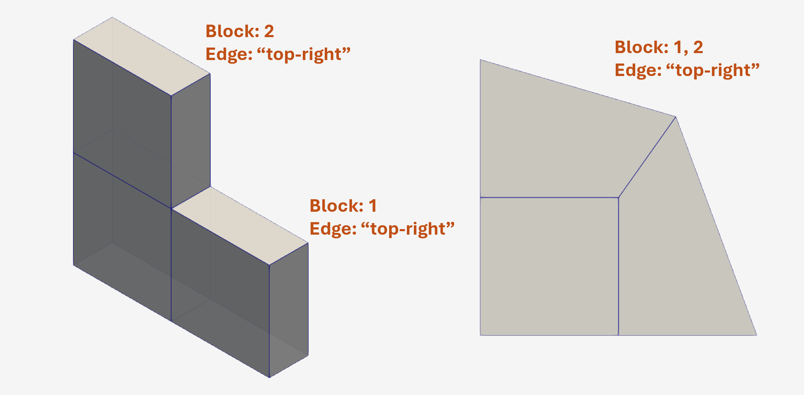
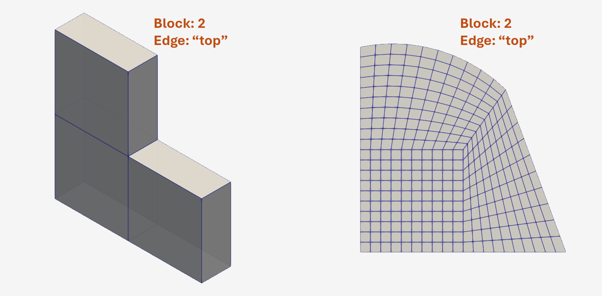
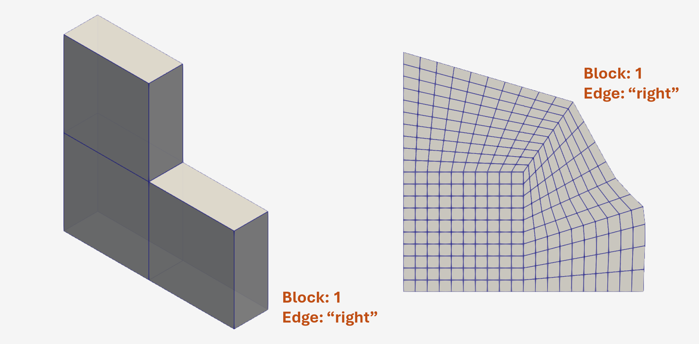

# Feature Manual

Feature manual for **Simply multiBLockMesh** (SimBloM).

To Use these feature to create the intended multi-block, the user need to add the feature/edit entries to the <u>feature edit input file</u> - **`block_edit_*.py`**. As the file extension says. The <u>feature edit input file</u> is a Python file. The user must know basic Python syntax and Python data structures (integer, float, string, list, dictionary)

[Back to manual home](../README.md)


## Table of Contents

- [Vertex Feature](#vertex-feature)
    - [Vertex Move](#vertex-move)
    - [Vertex Collapse](#vertex-collapse)
    - [Vertex Move-Collapse](#vertex-move-collapse)
    - [Vertex Scale](#vertex-scale)
- [Edge Feature](#edge-feature)
    - [Edge Move](#edge-move)
    - [Edge Collapse](#edge-collapse)
    - [Edge Move-Collapse](#edge-move-collapse)
    - [Edge Scale](#edge-scale)
    - [Edge - Make-arc](#edge---make-arc)
    - [Edge - Make-polyline](#edge---make-polyline)
    - [Edge - Make-polySpline](#edge---make-polyspline)
    - [Edge - Make-bSpline](#edge---make-bspline)
- [Face Feature](#face-feature)
    - [Face Move](#feature-manual)
    - [Face Scale](#face-scale)
- [Block Feature](#block-feature)
    - [Block Move](#block-move)
    - [Block Scale 2D](#block-scale-2d)
    - [Block Scale 3D](#block-scale-3d)


<br>

> ### Vertex Feature

Vertex features with example

<br>

#### Vertex Move

To move `vertex 7` to `(0.1, 0.1, 0.1)` use the **vertex move** feature - 


<br>

```Python

### operationId --> represents operation id.
### recommended to use an integer not assigned to any other VERTEX operation


### Sample entry - vertex - move

vertexEdit[operationId] = {
    "edit-type" : "move",
    "id":2,
    "new-location" : [1.2, 0.0, 0.0],
}

```

[[Back to the top](#table-of-contents)]

<br>

#### Vertex Collapse

To collapse `vertex 16` to `vertex 7` use the **vertex collapse** feature - 



<br> 

```Python

### operationId --> represents operation id.
### recommended to use an integer not assigned to any other VERTEX operation

### Sample entry - vertex - collapse

vertexEdit[operationId] = {
    "edit-type" : "collapse",
    "id":8,
    "target-vertex" : 5
}

```

<br>

[[Back to the top](#table-of-contents)]

#### Vertex Move-Collapse

To collapse `vertex 16` to `vertex 7`  and then move the collapsed vertex to `(0.6, 1.1, 0.0)` use **vertex move** feature - 



```Python

### operationId --> represents operation id.
### recommended to use an integer not assigned to any other VERTEX operation

### Sample entry - vertex - move-collapse

vertexEdit[operationId] = {
    "edit-type" : "move-collapse",
    "id":8,
    "target-vertex" : 5,
    "new-location" : [1.2, 0.5, 0.0],
}

```

<br>

[[Back to the top](#table-of-contents)]

#### Vertex Scale 

To scale `vertex 8` with respect to a reference point `(1.0, 1.0, 0.05)`  use **vertex scale** feature - 


```Python

### operationId --> represents operation id.
### recommended to use an integer not assigned to any other VERTEX operation

### Sample entry - vertex - scale

vertexEdit[operationId] = {
    "edit-type" : "scale",
    "id":8,
    "ratio" : 2.0,
    "reference" : [1.0, 1.0, 0.05]
}

```

[[Back to the top](#table-of-contents)]

<br><br><br>

> ### Edge Feature

Edge features with example

<br>

#### Edge Move

To move `edge - "top-right" (block 0)` to a distance of `(delta-x, delta-y, delta-z) = (0.1, 0.1, 0.0)` use the **edge move** feature - 



<br>

```Python

### operationId --> represents operation id.
### recommended to use an integer not assigned to any other EDGE operation


### Sample entry - edge - move

edgeEdit[operationId] = {
    "edit-type" : "move",

    "edge" : {
        "block-id" : 0,
        "position" : ["top", "right"],
    },
    
    "delta" : [0.1, 0.1, 0.0]
}

```

[[Back to the top](#table-of-contents)]

<br>

#### Edge Collapse

To collapse `edge - "top-right" (block 2)` to `edge - "top-right" (block 1)` use the **edge collapse** feature - 


<br>

```Python

### operationId --> represents operation id.
### recommended to use an integer not assigned to any other EDGE operation


### Sample entry - edge - collapse

edgeEdit[operationId] = {
    "edit-type" : "collapse",

    "edge" : {
        "block-id" : 2,
        "position" : ["top", "right"],
    },
    
    "target-edge" : {
        "block-id" : 1,
        "position" : ["top", "right"],
    },
}

```

[[Back to the top](#table-of-contents)]

<br>

#### Edge Move-Collapse

To collapse `edge - top-right (block 2)` to `edge - top-right (block 1)` and then to move the **collapsed edge** to a distance of `(delta-x, delta-y, delta-z) = (-0.2929, 0.2929, 0.0)` use the **edge move-collapse** feature - 



<br>

```Python

### operationId --> represents operation id.
### recommended to use an integer not assigned to any other EDGE operation


### Sample entry - edge - move-collapse

edgeEdit[operationId] = {
    "edit-type" : "move-collapse",

    "edge" : {
        "block-id" : 2,
        "position" : ["top", "right"],
    },
    
    "target-edge" : {
        "block-id" : 1,
        "position" : ["top", "right"],
    },

    "delta" : [-0.2929, 0.2929, 0.1],
}

```

[[Back to the top](#table-of-contents)]

<br>

#### Edge Scale

To scale `edge - top-right (block 3)` with respect to its center, use the **edge scale** feature - 


<br>

```Python

### operationId --> represents operation id.
### recommended to use an integer not assigned to any other EDGE operation


### Sample entry - edge - move-collapse

edgeEdit[operationId] = {
    "edit-type" : "scale",
    
    "edge":{
        "block-id" : 3,
        "position" : ["top", "right"],
        },
    
    "ratio" : 4.0,
}

```

[[Back to the top](#table-of-contents)]

<br>

#### Edge - Make Arc

To create arc for the `edge - back-top (block 2)` and `edge - front-top (block 2)` edges,  use the **edge make-arc** feature - 

**NOTE**: <u>To see the effect of acr/spline/polyline/polySpline/bSpline on block edges, there has to be more than one grid (along the axes)</u>. So, updating the grid spacing for the illustration case - 

```bash

### From this
gid_spacing='{
    "x" : 1000,
    "y" : 1000,
    "z" : 1000
}'

### To this
gid_spacing='{
    "x" : 0.05,
    "y" : 0.05,
    "z" : 0.05
}'

```



<br>

```Python

### Perform move-collapse as explained above, then ...

edgeEdit[operationId_1] = {
    "edit-type" : "make-arc",
    "method" : "arc-point",
    
    "edge":{
        "block-id" : 2,
        "position" : ["back", "top"],
        },
    
    "arc-point" : [1.25, 0.25, 0.0],
}

edgeEdit[operationId_2] = {
    "edit-type" : "make-arc",
    "method" : "center-radius",
    
    "edge":{
        "block-id" : 2,
        "position" : ["front", "top"],
        },
    
    "center" : [0.0, 0.0, 0.0],
    "angle" : 67.5,
    "radius" : 1.0,
}

```

[[Back to the top](#table-of-contents)]

<br>

#### Edge - Make-Spline

To create spline for the `edge - back-right (block 1)` and `edge - front-right (block 1)` edges,  use the **edge make-spline** feature - 

<u>Make sure to use fine grides to see the effect of splined edge.</u>



<br>

```Python

### Perform move-collapse as explained above, then ...

edgeEdit[operationId_1] = {
    "edit-type" : "make-spline",
    "method" : "spline-point",
    
    "edge":{
        "block-id" : 1,
        "position" : ["back", "right"],
        },
    
    "spline-point" : [
            [1.0, 0.35, 0.0],
            [0.9, 0.45, 0.0]
        ],
}

edgeEdit[operationId_2] = {
    "edit-type" : "make-spline",
    "method" : "spline-point",
    
    "edge":{
        "block-id" : 1,
        "position" : ["front", "right"],
        },
    
    "spline-point" : [
            [1.0, 0.35, 0.2],
            [0.9, 0.45, 0.2]
        ],
}
```

<br>

#### Edge - Make-polyline

##### Feature unavailable temporarily

This is similar to the **edge make-spline** feature. Need to specify the correct edit type.

```Python
    ### polySpline
    ### Type of edge edit
    "edit-type" : "make-polyline",

```

<br>

#### Edge - Make-polySpline

##### Feature unavailable temporarily

This is similar to the **edge make-spline** feature. Need to specify the correct edit type.

```Python
    ### polySpline
    ### Type of edge edit
    "edit-type" : "make-polySpline",

```

<br>

#### Edge - Make-bSpline

##### Feature unavailable temporarily

This is similar to the **edge make-spline** feature. Need to specify the correct edit type.

```Python
    ### polySpline
    ### Type of edge edit
    "edit-type" : "make-bSpline",

```

<br><br><br>

> ### Face Feature

Face features with example

<br>

#### Face Move

To move `face - "left" (block 3)` to a distance of `(delta-x, delta-y, delta-z) = (0.0, 0.3, 0.0)` use the **face move** feature - 


<br>

```Python

### operationId --> represents operation id.
### recommended to use an integer not assigned to any other FACE operation


### Sample entry - face - move

faceEdit[operationId] = {
    "edit-type" : "move",
    "face" : {
        "block-id" : 3,
        "side" : "left" 
    },
    "delta" : [0.0, 0.3, 0.0],
}

```

[[Back to the top](#table-of-contents)]

<br>

#### Face Scale

To scale `face - "left" (block 3)` with respect to its center, use the **face scale** feature - 


<br>

```Python

### operationId --> represents operation id.
### recommended to use an integer not assigned to any other FACE operation


### Sample entry - face - scale

faceEdit[operationId] = {
    "edit-type" : "scale",
    "face" : {
        "block-id" : 3,
        "side" : "left" 
    },
    "ratio" : 2.0,
}

```

[[Back to the top](#table-of-contents)]

<br><br><br>

> ### Block Feature

Block features with example

<br>

#### Block Move

To move `block - 3` to a distance of `(delta-x, delta-y, delta-z) = (0.4, 0.3, 0.2)` use the **block move** feature - 


<br>

```Python

### operationId --> represents operation id.
### recommended to use an integer not assigned to any other EDGE operation


### Sample entry - edge - move

blockEdit[operationId] = {
    "edit-type" : "move",
    "block-id" : 3,
    "delta" : [0.4, 0.3, 0.2],
    
}

```

[[Back to the top](#table-of-contents)]

<br>

#### Block Scale (2D)

To scale `block - 3` along a plane, with respect to a `reference point (0.75, 0.75, 0.05)` use the **block scale2d** feature - 


<br>

```Python

### operationId --> represents operation id.
### recommended to use an integer not assigned to any other EDGE operation


### Sample entry - edge - move

blockEdit[operationId] = {
    "edit-type" : "scale-2d",
    "block-id" : 3,
    "plane" : "xy",
    "ratio" : 0.5,
    "reference" : [0.75, 0.75, 0.05]
    
}

```

[[Back to the top](#table-of-contents)]

<br>

#### Block Scale (3D)

To scale `block - 3` along a plane, with respect to a its center, use the **block scale3d** feature -  


<br>

```Python

### operationId --> represents operation id.
### recommended to use an integer not assigned to any other EDGE operation


### Sample entry - edge - move

edgeEdit[operationId] = {
    "edit-type" : "scale-3d",
    "block-id" : 3,
    "ratio" : 1.5,
}

```

[[Back to the top](#table-of-contents)]

<br>


